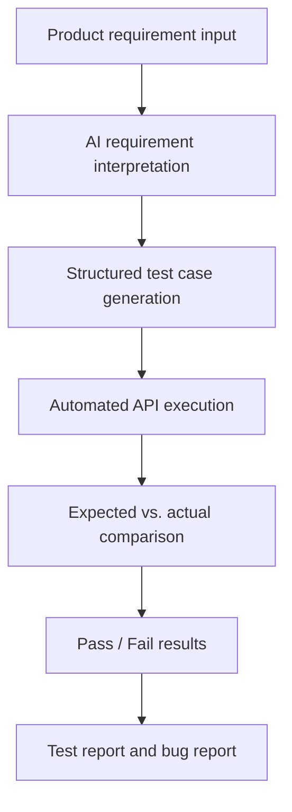

# AI Automated Testing Workflow Prototype

A minimum viable prototype that demonstrates how AI can transform a product requirement into structured API test cases, execute them automatically, compare expected and actual results, and identify a functional bug.

The test target is a React + Flask registration and login system backed by SQLite.

## Core Workflow



## Current Implementation

The prototype currently supports:

- React registration, login, welcome, and AI testing pages
- Flask registration, login, health-check, AI generation, and test execution APIs
- SQLite user storage
- Password hashing with Werkzeug
- AI generation of five structured Chinese test cases
- Normal, boundary, and invalid-input test coverage
- Automated execution against `POST /api/register`
- Pydantic validation of AI-generated test case structures
- Expected and actual HTTP status code comparison
- Pass/Fail result display
- Automatic prerequisite setup for duplicate-username tests
- Automatic cleanup of newly created test accounts
- Detection of the intentionally planted username-length bug
- Initial Playwright UI automation test for the registration page
- In-app Playwright execution with UI Pass/Fail results
- Manual and automated execution records
- Final test report, bug report, and plugin architecture documentation

## Verified Test Results

### Automated API Testing

The formal automated test was executed on August 13, 2026.

| Total | Passed | Failed | Pass Rate | Result |
| ---: | ---: | ---: | ---: | --- |
| 5 | 4 | 1 | 80% | The intentional username-length bug was detected |

### Manual Testing

Three core manual tests were executed:

| Test | Result |
| --- | --- |
| Valid user registration | Pass |
| Login with valid credentials | Pass |
| Registration with a five-character username | Fail |

The failed manual test reproduced the same username-length validation bug found by the automated test.

## Technology Stack

### Frontend

- React
- Vite
- Axios
- React Router
- Ant Design
- Playwright

### Backend and AI

- Python
- Flask
- Flask-CORS
- SQLite
- OpenAI Responses API
- Pydantic structured output validation
- python-dotenv
- Werkzeug password hashing

## Main API Endpoints

| Method | Endpoint | Purpose |
| --- | --- | --- |
| `GET` | `/api/health` | Check whether the Flask backend is running |
| `POST` | `/api/register` | Register a user |
| `POST` | `/api/login` | Log in an existing user |
| `POST` | `/api/ai/generate-tests` | Generate structured test cases from a requirement |
| `POST` | `/api/tests/execute` | Execute generated test cases and return results |
| `POST` | `/api/ui-tests/execute` | Run the registered Playwright UI test and return results |

For safety, the current automated executor only accepts test cases targeting:

```text
POST /api/register
```

Unsupported methods or endpoints are returned as `Error`.

## Project Structure

```text
AI_Testing_Plugin_Project/
├── backend/
│   ├── app.py
│   ├── database.py
│   └── requirements.txt
│
├── frontend/
│   ├── src/
│   │   ├── App.jsx
│   │   └── pages/
│   │       ├── LoginPage.jsx
│   │       ├── RegisterPage.jsx
│   │       ├── WelcomePage.jsx
│   │       └── GenerateTestsPage.jsx
│   ├── package.json
│   └── vite.config.js
│
├── docs/
│   ├── PRD.md
│   ├── Requirement_Specification.md
│   ├── Test_Cases.xlsx
│   ├── Test_Report.md
│   ├── Bug_Report.md
│   └── AI_Plugin_Architecture.md
│
├── screenshots/
│   ├── MT-001_register_success.png
│   ├── MT-002_login_success.png
│   └── MT-003_short_username_bug.png
│
├── tests/
├── .gitignore
└── README.md
```

The `Test_Cases.xlsx` workbook contains the test summary, AI-generated test cases with real automated execution results, and manual test execution records.

## Project Documents

- [Product Requirements Document](docs/PRD.md)
- [Requirement Specification](docs/Requirement_Specification.md)
- [Test Cases and Execution Records](docs/Test_Cases.xlsx)
- [Test Report](docs/Test_Report.md)
- [Bug Report](docs/Bug_Report.md)
- [AI Plugin Architecture](docs/AI_Plugin_Architecture.md)

## Setup and Run

### 1. Start the Backend

```bash
cd backend
python3 -m venv .venv
source .venv/bin/activate
pip install -r requirements.txt
pip install openai python-dotenv flask-cors pydantic
```

Create `backend/.env` and add an OpenAI API key:

```env
OPENAI_API_KEY=your_api_key_here
```

Never commit `.env` or a real API key to GitHub.

Initialize the database and start Flask:

```bash
python database.py
python app.py
```

The backend runs at:

```text
http://127.0.0.1:5000
```

### 2. Start the Frontend

Open a second terminal:

```bash
cd frontend
npm install
npm run dev
```

The frontend runs at:

```text
http://localhost:5173
```

### 3. Run the AI Testing Prototype

1. Open `http://localhost:5173/generate-tests`.
2. Enter a product requirement.
3. Click **生成测试用例**.
4. Review the five AI-generated test cases.
5. Click **执行测试**.
6. Review the expected status code, actual status code, and Pass/Fail result.

Generating test cases calls the OpenAI API. Executing the generated cases runs locally against Flask and does not make another OpenAI request.

### 4. Run the First UI Automation Test

Start the Flask backend first:

```bash
cd backend
python app.py
```

You can run the Playwright UI test from another terminal:

```bash
cd frontend
npm run test:ui
```

The first UI test opens the registration page, enters a five-character username, submits the form, and expects the backend to reject it with HTTP `400`.

Because the username-length bug is intentionally still present, this test currently fails with actual HTTP `201`. This is expected and demonstrates that UI automation can detect the same product bug through real browser interaction.

The same test can also be started from the **UI 自动化测试** section on
`http://localhost:5173/generate-tests`. The page displays the browser, expected
and actual status codes, duration, and Pass/Fail result returned by Flask.

## Intentional Functional Bug

Requirement `REG-002` states that a username must contain at least six characters.

The registration implementation intentionally does not enforce this rule so that the testing workflow can discover a known functional defect.

Example:

```text
Username: m813x
Username length: 5 characters
```

Expected behavior:

```text
Registration is rejected with HTTP 400.
```

Actual behavior:

```text
Registration succeeds with HTTP 201.
```

Test result:

```text
Fail
```

This bug remains unfixed during the prototype stage because it is used to demonstrate requirement analysis, AI test generation, automated execution, manual verification, test reporting, and bug reporting.

## Password and Data Security

User passwords are not stored as plaintext. Werkzeug converts passwords into hashes before saving them in SQLite, and login validation compares the submitted password against the stored hash.

The following local files are excluded from Git:

- `backend/.env`
- `backend/users.db`
- Python virtual environment files
- frontend `node_modules`
- build outputs and logs

SQLite data persists across normal application restarts because it is stored locally in `backend/users.db`.

## Current Limitations

This is a testing prototype rather than a production testing platform.

Current limitations include:

- AI generation is designed specifically for the registration API
- The executor currently supports only `POST /api/register`
- Test results are mainly evaluated through HTTP status codes
- Complete PRD file parsing is not yet implemented
- Browser-based UI automation is not yet implemented
- Test reports are not yet exported automatically by the application
- Bug submission to GitHub Issues or Azure DevOps is not yet connected

The architecture document describes how the prototype can later be extended to PRD parsing, multi-endpoint testing, browser automation, report generation, and automatic bug submission.
