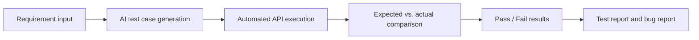

# AI Automated Testing Workflow Prototype

An MVP that demonstrates how AI can turn a product requirement into executable API test cases, run them automatically, compare expected and actual results, and identify a functional bug.

The current test target is a simple registration and login system built with React, Flask, and SQLite.

## Core Workflow



The prototype currently supports the workflow through Pass/Fail result display. Test summary, report generation, and bug report generation are the next planned steps.

## Current Progress

### Completed

- React registration, login, welcome, and AI testing pages
- Flask registration, login, health-check, AI generation, and test execution APIs
- SQLite user storage and duplicate username validation
- AI generation of five structured Chinese test cases from a requirement
- Normal, boundary, and invalid-input test coverage
- Automatic execution of generated cases against `POST /api/register`
- Expected and actual HTTP status code comparison
- Pass/Fail display in the frontend
- Prerequisite setup for duplicate-username tests
- Test-account cleanup to reduce database pollution and false failures
- Successful detection of the intentionally planted username-length bug

Latest verified result for the requirement `用户名至少需要6个字符`:

| Total | Pass | Fail | Result |
| ---: | ---: | ---: | --- |
| 5 | 4 | 1 | The intentional short-username bug was detected |

### Planned

- Display total, passed, failed, and pass-rate summary in the frontend
- Generate a structured test report from execution results
- Generate a standard bug report from failed test cases
- Simulate bug submission or tracking
- Complete the plugin architecture, prompt logic, and system flow diagrams
- Extend the prototype from one registration requirement and endpoint to full PRD analysis and multiple APIs

## Product and Testing Principle

The human provides the product requirements and business rules. AI interprets those requirements, adds relevant boundary and invalid-input scenarios, generates executable test cases, and analyzes the results.

The final output should include both a quality summary and detailed bug information. Pass rate provides an overview, while the failed requirement, reproduction steps, expected result, actual result, and severity explain the actionable problem.

## Technology Stack

### Frontend

- React
- Vite
- Axios
- React Router
- Ant Design

### Backend and AI

- Python
- Flask and Flask-CORS
- SQLite
- OpenAI Responses API
- Pydantic structured output validation
- python-dotenv

## Main API Endpoints

| Method | Endpoint | Purpose |
| --- | --- | --- |
| `GET` | `/api/health` | Check whether the Flask backend is running |
| `POST` | `/api/register` | Register a user |
| `POST` | `/api/login` | Log in an existing user |
| `POST` | `/api/ai/generate-tests` | Generate structured test cases from a requirement |
| `POST` | `/api/tests/execute` | Execute generated cases and return Pass/Fail results |

For safety, the current test executor only accepts `POST /api/register` cases.

## Project Structure

```text
AI_Testing_Plugin_Project/
├── backend/
│   ├── app.py
│   ├── database.py
│   └── requirements.txt
├── frontend/
│   ├── src/
│   │   └── pages/
│   │       ├── LoginPage.jsx
│   │       ├── RegisterPage.jsx
│   │       ├── WelcomePage.jsx
│   │       └── GenerateTestsPage.jsx
│   ├── package.json
│   └── vite.config.js
├── .gitignore
└── README.md
```

## Setup and Run

### 1. Start the Backend

```bash
cd backend
python3 -m venv .venv
source .venv/bin/activate
pip install -r requirements.txt
pip install openai python-dotenv flask-cors pydantic
```

Create `backend/.env` and add your OpenAI API key:

```env
OPENAI_API_KEY=your_api_key_here
```

Never commit `.env` or a real API key to GitHub.

Initialize the database and start Flask:

```bash
python database.py
python app.py
```

The backend runs at `http://127.0.0.1:5000`.

### 2. Start the Frontend

Open a second terminal:

```bash
cd frontend
npm install
npm run dev
```

The frontend runs at `http://localhost:5173`.

### 3. Run the AI Testing Demo

1. Open `http://localhost:5173/generate-tests`.
2. Enter a requirement, for example: `用户名至少需要6个字符`.
3. Click **生成测试用例**. This calls the OpenAI API and may incur a small API charge.
4. Review the five generated test cases.
5. Click **执行测试**. This runs locally against Flask and does not call OpenAI again.
6. Review the expected status code, actual status code, and Pass/Fail result.

## Intentional Test Bug

Requirement `REG-002` states that a username must contain at least six characters. The registration implementation intentionally does not enforce this rule.

Example test data:

```text
Username: q7x
Password: 123456
```

- Expected: registration fails with HTTP `400`.
- Actual: registration succeeds with HTTP `201`.
- Test status: `Fail`.

This defect must remain unfixed during the prototype stage because it is used to demonstrate requirement analysis, AI test generation, automatic execution, test reporting, and bug report generation.

## Important Notes

- This project is a testing prototype and is not intended for production use.
- Passwords are stored as plain text in SQLite to keep the demo simple. Production systems must use password hashing and stronger authentication controls.
- The AI generator and executor are currently designed specifically for the registration API.
- SQLite data persists across normal restarts because it is stored in `backend/users.db`; the file is excluded from Git.
- Generated test content can vary between AI calls, so results should be reviewed before execution.
