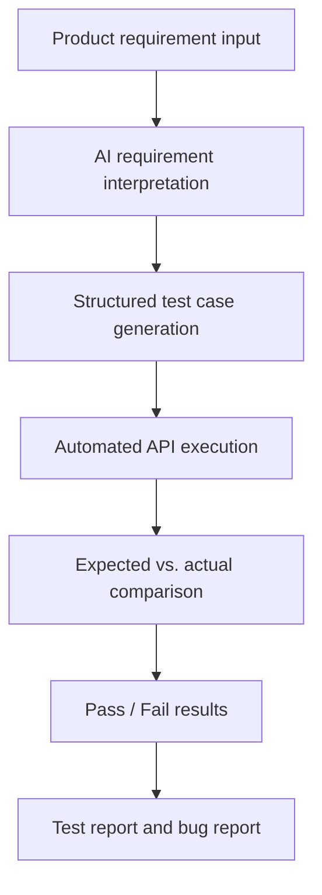

# AI Automated Testing Workflow Prototype

A minimum viable prototype that demonstrates how AI can transform a product requirement into structured API test cases, execute them automatically, compare expected and actual results, and identify a functional bug.

The test target is a React + Flask registration and login system backed by SQLite.

## Core Workflow



## Current Implementation

The prototype currently supports:

- React registration, login, welcome, and AI testing pages
- Flask registration, login, health-check, AI generation, and test execution APIs
- SQLite user storage
- Password hashing with Werkzeug
- AI generation of five structured Chinese test cases
- Normal, boundary, and invalid-input test coverage
- Automated execution against `POST /api/register`
- Pydantic validation of AI-generated test case structures
- Expected and actual HTTP status code comparison
- Pass/Fail result display
- Automatic prerequisite setup for duplicate-username tests
- Automatic cleanup of newly created test accounts
- Detection of the intentionally planted username-length bug
- Five Playwright UI automation tests for the registration page
- In-app Playwright execution with UI Pass/Fail results
- Manual and automated execution records
- Final test report, bug report, and plugin architecture documentation

## Verified Test Results

### Automated API Testing

The formal automated test was executed on August 13, 2026.

| Total | Passed | Failed | Pass Rate | Result |
| ---: | ---: | ---: | ---: | --- |
| 5 | 4 | 1 | 80% | The intentional username-length bug was detected |

### Manual Testing

Three core manual tests were executed:

| Test | Result |
| --- | --- |
| Valid user registration | Pass |
| Login with valid credentials | Pass |
| Registration with a five-character username | Fail |

The failed manual test reproduced the same username-length validation bug found by the automated test.

### UI Automation Testing

The UI automation tests were executed through Flask on September 7, 2026, and
were re-run locally with Playwright on September 8, 2026.

| Total | Passed | Failed | Errors | Result |
| ---: | ---: | ---: | ---: | --- |
| 5 | 4 | 1 | 0 | The intentional username-length bug was detected through real browser interaction |

| Test | Scenario | Result |
| --- | --- | --- |
| REG-001 | Valid username and password can register successfully | Pass |
| REG-002 | Username shorter than 6 characters should be rejected | Fail |
| REG-003 | Empty username is blocked by frontend validation | Pass |
| REG-004 | Empty password is blocked by frontend validation | Pass |
| REG-005 | Duplicate username is rejected | Pass |

## Technology Stack

### Frontend

- React
- Vite
- Axios
- React Router
- Ant Design
- Playwright

### Backend and AI

- Python
- Flask
- Flask-CORS
- SQLite
- OpenAI Responses API
- Pydantic structured output validation
- python-dotenv
- Werkzeug password hashing

## Main API Endpoints

| Method | Endpoint | Purpose |
| --- | --- | --- |
| `GET` | `/api/health` | Check whether the Flask backend is running |
| `POST` | `/api/register` | Register a user |
| `POST` | `/api/login` | Log in an existing user |
| `POST` | `/api/ai/generate-tests` | Generate structured test cases from a requirement |
| `POST` | `/api/tests/execute` | Execute generated test cases and return results |
| `POST` | `/api/ui-tests/execute` | Run the registered Playwright UI test and return results |

For safety, the current automated executor only accepts test cases targeting:

```text
POST /api/register
```

Unsupported methods or endpoints are returned as `Error`.

## Project Structure

```text
AI_Testing_Plugin_Project/
├── backend/
│   ├── app.py
│   ├── database.py
│   └── requirements.txt
│
├── frontend/
│   ├── src/
│   │   ├── App.jsx
│   │   └── pages/
│   │       ├── LoginPage.jsx
│   │       ├── RegisterPage.jsx
│   │       ├── WelcomePage.jsx
│   │       └── GenerateTestsPage.jsx
│   ├── package.json
│   └── vite.config.js
│
├── docs/
│   ├── PRD.md
│   ├── Requirement_Specification.md
│   ├── Test_Cases.xlsx
│   ├── Test_Report.md
│   ├── Bug_Report.md
│   └── AI_Plugin_Architecture.md
│
├── screenshots/
│   ├── MT-001_register_success.png
│   ├── MT-002_login_success.png
│   └── MT-003_short_username_bug.png
│
├── tests/
├── .gitignore
└── README.md
```

The `Test_Cases.xlsx` workbook contains the test summary, AI-generated test cases with real automated execution results, and manual test execution records.

## Project Documents

- [Product Requirements Document](docs/PRD.md)
- [Requirement Specification](docs/Requirement_Specification.md)
- [Test Cases and Execution Records](docs/Test_Cases.xlsx)
- [Test Report](docs/Test_Report.md)
- [Bug Report](docs/Bug_Report.md)
- [AI Plugin Architecture](docs/AI_Plugin_Architecture.md)

## Local Setup Guide

Follow this section if you are cloning or downloading the project for the first
time and want to run it locally.

### 1. Prerequisites

Make sure your computer has:

- Python 3.10 or later
- Node.js 18 or later
- npm
- Git, if you are cloning from GitHub
- An OpenAI API key, required only when generating AI test cases

Playwright is installed through the frontend npm dependencies, but its browser
runtime must be installed once after `npm install`.

### 2. Download the Project

```bash
git clone https://github.com/Yuchen-Zhou-ucsc/AI_Testing_Plugin_Project.git
cd AI_Testing_Plugin_Project
```

If you downloaded a ZIP file instead, unzip it and open a terminal in the
`AI_Testing_Plugin_Project` folder.

### 3. Install Backend Dependencies

```bash
cd backend
python3 -m venv .venv
source .venv/bin/activate
pip install -r requirements.txt
```

Inside the `backend` folder, create a `.env` file and add your OpenAI API key:

```env
OPENAI_API_KEY=your_api_key_here
```

Never commit `.env` or a real API key to GitHub. If you only want to test
manual registration, login, or the Playwright UI suite, the app can still start
without generating new AI test cases.

Initialize the database:

```bash
python database.py
```

### 4. Install Frontend Dependencies and Playwright Browser

Open a second terminal from the project root:

```bash
cd frontend
npm install
npx playwright install chromium
```

The `npm install` command installs React, Vite, Ant Design, and Playwright's
test runner. The `npx playwright install chromium` command downloads the
Chromium browser that the UI automation tests use.

### 5. Start the Backend

In the backend terminal, keep the terminal inside the `backend` folder and run:

```bash
source .venv/bin/activate
python app.py
```

The backend should run at:

```text
http://127.0.0.1:5000
```

### 6. Start the Frontend

In the frontend terminal, keep the terminal inside the `frontend` folder and run:

```bash
npm run dev
```

The frontend should run at:

```text
http://localhost:5173
```

Open:

```text
http://localhost:5173/generate-tests
```

### 7. Run the AI Testing Prototype

1. Open `http://localhost:5173/generate-tests`.
2. Enter a product requirement.
3. Click **生成测试用例**.
4. Review the five AI-generated test cases.
5. Click **执行测试**.
6. Review the expected status code, actual status code, and Pass/Fail result.

Generating test cases calls the OpenAI API. Executing the generated cases runs locally against Flask and does not make another OpenAI request.

### 8. Run the UI Automation Tests

Before running UI automation, keep both services running:

- Flask backend: `http://127.0.0.1:5000`
- React frontend: `http://localhost:5173`

Then run the Playwright UI tests from the frontend terminal:

```bash
npm run test:ui
```

The UI test suite opens the registration page in Chromium and currently covers five registration scenarios:

| Test | Expected result |
| --- | --- |
| REG-001 | Valid username and password return HTTP `201` and redirect to `/login` |
| REG-002 | Five-character username should return HTTP `400` |
| REG-003 | Empty username shows frontend validation and sends no register request |
| REG-004 | Empty password shows frontend validation and sends no register request |
| REG-005 | Duplicate username returns HTTP `409` |

Because the username-length bug is intentionally still present, `REG-002` currently fails with actual HTTP `201`. This is expected and demonstrates that UI automation can detect the same product bug through real browser interaction.

The same UI suite can also be started from the **UI 自动化测试** section on
`http://localhost:5173/generate-tests`. The page displays the browser, expected
and actual status codes, duration, and Pass/Fail result returned by Flask.

### 9. View the Browser-Based UI Test Process

If you want to watch the browser automation process, keep the Flask backend
running and start the headed Playwright test from another terminal:

```bash
npm run test:ui:headed
```

This opens a visible Chromium window and runs the same five registration UI
tests. The expected result is four passing tests and one failing test:

```text
REG-001: Pass
REG-002: Fail
REG-003: Pass
REG-004: Pass
REG-005: Pass
```

`REG-002` is expected to fail because the username-length validation bug is
intentionally preserved for the MVP demo.

For a slower demo that is easier to observe, run:

```bash
npx playwright test tests/ui/register.spec.js --headed --slow-mo=800
```

## Quick Verification Checklist

After setup, a successful local run should look like this:

| Check | Expected result |
| --- | --- |
| Backend | `http://127.0.0.1:5000/api/health` returns a success message |
| Frontend | `http://localhost:5173/generate-tests` opens the AI testing page |
| API test execution | Five generated registration API tests run with Pass/Fail results |
| UI automation | Five registration UI tests run: 4 Pass, 1 Fail, 0 Error |

The one expected UI failure is `REG-002`, because the username-length bug is
intentionally preserved for the MVP demo.

## Common Setup Issues

### `ModuleNotFoundError` when starting Flask

Make sure the backend virtual environment is active and dependencies are
installed:

```bash
cd backend
source .venv/bin/activate
pip install -r requirements.txt
```

### OpenAI API key error when generating test cases

Check that `backend/.env` exists and contains:

```env
OPENAI_API_KEY=your_api_key_here
```

Restart the Flask backend after editing `.env`.

### Playwright cannot find Chromium

Install the Playwright browser runtime from the frontend folder:

```bash
cd frontend
npx playwright install chromium
```

### UI tests cannot open the app

Make sure both local services are running before starting UI tests:

```text
Backend:  http://127.0.0.1:5000
Frontend: http://localhost:5173
```

## Intentional Functional Bug

Requirement `REG-002` states that a username must contain at least six characters.

The registration implementation intentionally does not enforce this rule so that the testing workflow can discover a known functional defect.

Example:

```text
Username: m813x
Username length: 5 characters
```

Expected behavior:

```text
Registration is rejected with HTTP 400.
```

Actual behavior:

```text
Registration succeeds with HTTP 201.
```

Test result:

```text
Fail
```

This bug remains unfixed during the prototype stage because it is used to demonstrate requirement analysis, AI test generation, automated execution, manual verification, test reporting, and bug reporting.

## Password and Data Security

User passwords are not stored as plaintext. Werkzeug converts passwords into hashes before saving them in SQLite, and login validation compares the submitted password against the stored hash.

The following local files are excluded from Git:

- `backend/.env`
- `backend/users.db`
- Python virtual environment files
- frontend `node_modules`
- build outputs and logs

SQLite data persists across normal application restarts because it is stored locally in `backend/users.db`.

## Current Limitations

This is a testing prototype rather than a production testing platform.

Current limitations include:

- AI generation is designed specifically for the registration API
- The executor currently supports only `POST /api/register`
- Test results are mainly evaluated through HTTP status codes
- Complete PRD file parsing is not yet implemented
- Browser-based UI automation currently covers only the registration page
- Test reports are not yet exported automatically by the application
- Bug submission to GitHub Issues or Azure DevOps is not yet connected

The architecture document describes how the prototype can later be extended to PRD parsing, multi-endpoint testing, browser automation, report generation, and automatic bug submission.
