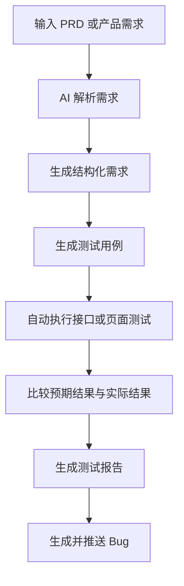
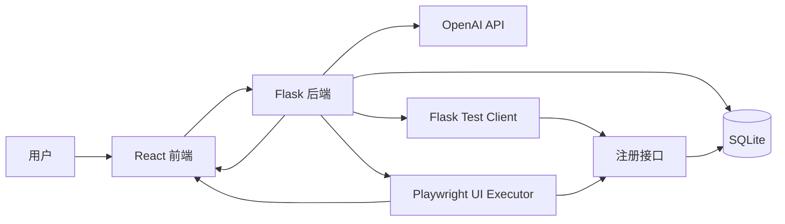
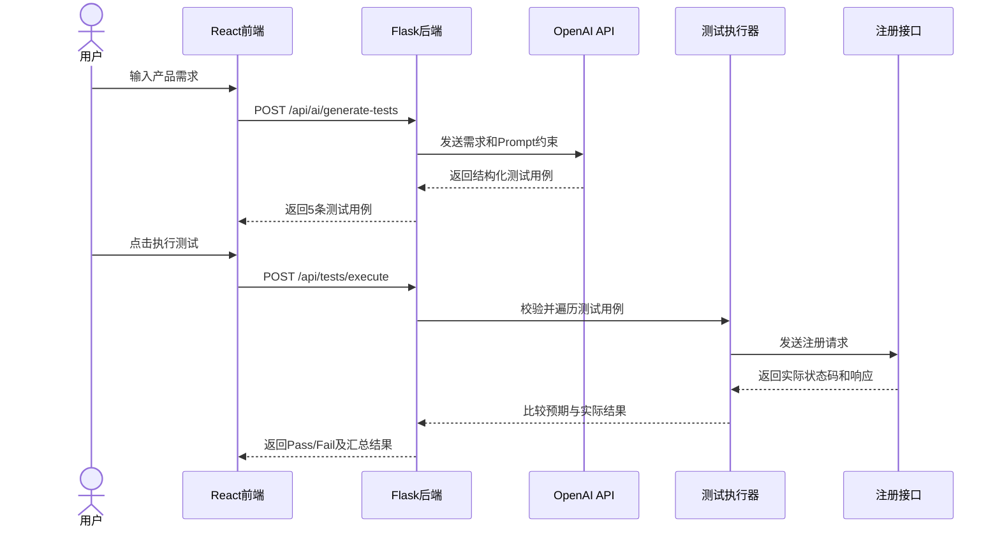
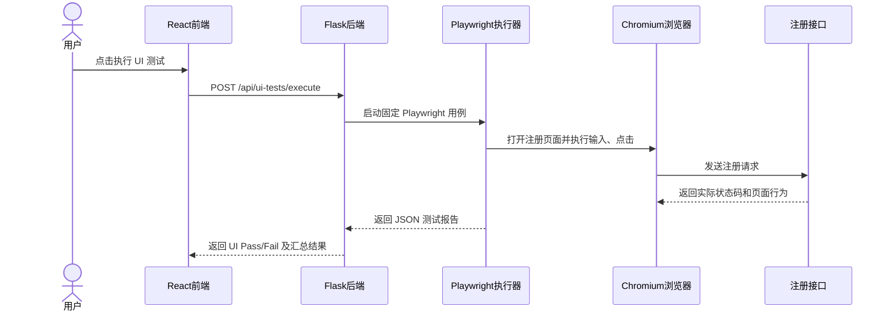

# AI 自动化测试插件最小原型架构方案

## 1. 文档信息

- 项目名称：自动化测试全流程插件原型 + React + Flask 登录注册 Demo 系统
- 文档类型：AI 自动化测试插件架构方案
- 版本：v1.0
- 日期：2026-08-13
- 项目负责人：Yuchen Zhou

## 2. 设计目标

本项目旨在验证 AI 驱动的软件测试闭环是否可行。用户输入产品需求后，系统通过大模型生成结构化测试用例，自动调用被测接口，比较预期结果和实际结果，并识别不符合需求的功能性问题。

完整插件目标链路如下：



当前版本为最小可验证原型，主要验证“需求输入、AI生成用例、接口自动执行、页面自动化执行、结果判断和Bug发现”这一核心链路。

## 3. 当前原型范围

### 3.1 已实现功能

- React 登录、注册、欢迎和 AI 测试页面
- Flask 注册、登录、健康检查、AI用例生成和自动执行接口
- SQLite 用户数据存储
- 密码哈希存储与登录密码校验
- 用户输入自然语言产品需求
- AI生成5条结构化注册接口测试用例
- 覆盖正常、边界和异常测试场景
- 自动执行 `POST /api/register`
- 比较预期HTTP状态码和实际HTTP状态码
- 在前端显示 Pass/Fail 结果
- 为重复用户名测试自动建立前置条件
- 自动清理测试中新创建的账号
- Playwright 注册页 UI 自动化测试
- Flask `/api/ui-tests/execute` 接口触发固定 UI 自动化用例
- 前端页面展示 UI 自动化测试汇总和明细结果
- 发现预埋的用户名长度校验Bug

### 3.2 当前未自动化的部分

- 直接读取完整PRD文件
- 自动拆解多个功能模块和多个接口
- 除注册页以外的浏览器页面自动化执行
- 自动生成并导出测试报告文件
- 自动向真实Bug管理平台提交Bug

当前版本通过 `Test_Report.md` 和 `Bug_Report.md` 保存最终测试交付结果，Bug推送流程以标准Bug单进行模拟。

## 4. 当前系统架构



### 4.1 前端层

前端使用 React、Axios、React Router 和 Ant Design。

主要页面包括：

| 页面 | 路由 | 作用 |
|---|---|---|
| 登录页面 | `/login` | 输入用户名和密码并登录 |
| 注册页面 | `/register` | 创建用户账号 |
| 欢迎页面 | `/welcome` | 显示登录成功信息 |
| AI测试页面 | `/generate-tests` | 输入需求、生成用例和执行测试 |

`GenerateTestsPage.jsx`负责：

1. 接收用户输入的产品需求；
2. 调用AI测试用例生成接口；
3. 将生成的测试用例显示为表格；
4. 将测试用例发送至自动执行接口；
5. 显示实际状态码和Pass/Fail结果。
6. 触发注册页 UI 自动化测试；
7. 显示 UI 自动化测试汇总、浏览器、耗时和每条用例的执行结果。

### 4.2 后端层

后端使用 Flask 提供业务接口和AI测试接口。

| 方法 | 接口 | 作用 |
|---|---|---|
| GET | `/api/health` | 检查后端运行状态 |
| POST | `/api/register` | 用户注册 |
| POST | `/api/login` | 用户登录 |
| POST | `/api/ai/generate-tests` | 根据需求生成结构化测试用例 |
| POST | `/api/tests/execute` | 自动执行生成的测试用例 |
| POST | `/api/ui-tests/execute` | 执行注册页 Playwright UI 自动化用例 |

### 4.3 AI生成层

后端使用 OpenAI Responses API，根据用户输入的需求生成5条测试用例。

Prompt约束包括：

- 覆盖正常、边界和异常场景；
- 测试编号固定为 `TC-001` 至 `TC-005`；
- 每条用例提供可执行的具体测试数据；
- 请求方法固定为 `POST`；
- 请求地址固定为 `/api/register`；
- 请求体必须包含 `username` 和 `password`；
- 注册成功预期状态码为201；
- 必填项错误和用户名长度不足预期状态码为400；
- 用户名重复预期状态码为409；
- 每条测试使用不同且不容易重复的用户名。

系统使用 Pydantic 约束AI输出结构，防止返回无法执行的自由文本。

单条测试用例的主要字段包括：

```text
test_case_id
test_scenario
preconditions
test_steps
test_data
expected_result
request_method
request_url
request_body
expected_status_code
```

### 4.4 自动执行层

自动执行接口接收结构化测试用例，并逐条完成以下操作：

1. 验证测试用例数据结构；
2. 检查请求方法和接口地址；
3. 建立重复用户名测试所需的前置条件；
4. 使用 Flask Test Client 调用真实注册接口；
5.记录实际HTTP状态码和实际响应；
6. 比较实际状态码与预期状态码；
7. 输出 Pass、Fail 或 Error；
8. 清理本次测试新创建的账号；
9. 汇总测试总数、通过数量和失败数量。

当前执行器出于安全考虑，只允许执行：

```text
POST /api/register
```

其他方法或接口会被标记为 Error，避免AI生成内容调用未知接口。

### 4.5 UI 自动化执行层

UI 自动化执行接口不接收任意命令或任意测试路径，只运行项目内固定登记的 Playwright 用例：

```text
frontend/tests/ui/register.spec.js
```

执行流程包括：

1. Flask 后端接收前端触发请求；
2. 后端启动 Playwright Chromium；
3. Playwright 打开注册页面并执行固定测试场景；
4. 用例通过页面输入、点击和网络响应监听判断实际结果；
5. Playwright 生成 JSON 格式执行报告；
6. Flask 解析报告并提取测试编号、场景、浏览器和耗时；
7. 后端将 Playwright 结果转换为 Pass、Fail 或 Error；
8. 前端展示 UI 自动化测试汇总和明细。

当前注册页 UI 自动化覆盖：

| 测试编号 | 场景 | 当前结果 |
| --- | --- | --- |
| REG-001 | 合法用户名和密码应注册成功并跳转登录页 | Pass |
| REG-002 | 用户名少于6个字符时应拒绝注册 | Fail |
| REG-003 | 用户名为空时应在前端提示必填并阻止提交 | Pass |
| REG-004 | 密码为空时应在前端提示必填并阻止提交 | Pass |
| REG-005 | 用户名已存在时应拒绝重复注册 | Pass |

其中 `REG-002` 的失败是预期演示结果，因为后端故意保留了用户名长度未校验 Bug。

### 4.6 数据存储层

SQLite负责保存用户数据，主要字段包括：

- 用户ID
- 用户名
- 密码哈希
- 创建时间

系统使用 Werkzeug 对密码进行哈希处理，数据库不直接保存用户明文密码。

## 5. 当前端到端执行链路

### 5.1 接口自动化执行链路



### 5.2 注册页 UI 自动化执行链路



## 6. 结果判断规则

接口自动化主要使用HTTP状态码作为判断依据：

```text
实际状态码 = 预期状态码 → Pass
实际状态码 ≠ 预期状态码 → Fail
用例结构错误或不支持执行 → Error
```

UI 自动化在 HTTP 状态码基础上，结合页面跳转、前端必填提示和网络请求是否发出进行判断。

正式测试结果为：

### 6.1 接口自动化结果

| 测试总数 | 通过 | 失败 | 通过率 |
|---:|---:|---:|---:|
| 5 | 4 | 1 | 80% |

失败用例为 `TC-004`：

- 需求：用户名长度必须不少于6个字符；
- 测试输入：4位用户名 `r5x2`；
- 预期结果：拒绝注册并返回HTTP 400；
- 实际结果：注册成功并返回HTTP 201；
- 测试状态：Fail；
- 发现问题：注册接口缺少用户名最小长度校验。

该结果证明当前原型能够根据产品需求生成边界测试，并通过自动执行发现预埋的业务规则Bug。

### 6.2 UI 自动化结果

| UI测试总数 | 通过 | 失败 | Error | 通过率 |
|---:|---:|---:|---:|---:|
| 5 | 4 | 1 | 0 | 80% |

失败用例为 `REG-002`：

- 测试入口：注册页面；
- 测试输入：运行时随机生成的5位用户名和有效密码；
- 预期结果：后端拒绝注册并返回HTTP 400；
- 实际结果：后端返回HTTP 201，页面进入注册成功流程；
- 测试状态：Fail。

2026-09-08 本地 Playwright 复核输出显示：`REG-001` 实际 HTTP 201，`REG-002` 实际 HTTP 201，`REG-003` 实际未发送注册请求，`REG-004` 实际未发送注册请求，`REG-005` 实际 HTTP 409。该结果说明同一个业务规则缺陷不仅能通过接口自动化发现，也能通过真实浏览器页面操作复现。UI 随机用户名没有在本次控制台输出中保存，因此架构文档不记录具体随机值。

## 7. 未来正式插件架构

正式插件将在当前原型基础上扩展为以下模块：

### 7.1 PRD解析模块

输入完整PRD文本或文档，识别：

- 产品模块
- 用户角色
- 功能需求
- 业务规则
- 异常规则
- 验收标准

### 7.2 需求结构化模块

将自然语言需求转换为统一结构，例如：

```json
{
  "requirement_id": "REG-002",
  "module": "用户注册",
  "rule": "用户名长度不少于6个字符",
  "expected_behavior": "少于6个字符时拒绝注册",
  "expected_status_code": 400
}
```

### 7.3 测试用例生成模块

根据结构化需求生成：

- 正常用例
- 边界用例
- 异常用例
- 前置条件
- 测试数据
- 预期结果
- 可执行请求参数

### 7.4 自动化执行模块

根据测试类型选择执行方式：

- API测试：调用HTTP接口；
- 页面测试：使用浏览器自动化工具操作页面；
- 数据验证：检查数据库或响应数据；
- 回归测试：修复Bug后重新执行失败用例。

### 7.5 结果分析模块

对比：

- 预期状态码与实际状态码；
- 预期响应字段与实际响应字段；
- 预期页面行为与实际页面行为；
- 需求规则与实际系统表现。

### 7.6 测试报告生成模块

自动汇总：

- 测试范围
- 测试环境
- 用例总数
- 通过数量
- 失败数量
- 通过率
- 缺陷数量
- 风险分析
- 发布建议

### 7.7 Bug生成与推送模块

将失败用例转换成标准Bug单，包含：

- Bug标题
- 关联需求
- 所属模块
- 严重程度
- 前置条件
- 复现步骤
- 测试数据
- 预期结果
- 实际结果
- 截图或日志证据

未来可接入GitHub Issues、Azure DevOps或其他Bug管理平台，实现自动推送。

## 8. 正式插件任务拆解

| 阶段 | 核心任务 | 输出 |
|---|---|---|
| 1 | 读取和解析PRD | PRD结构化数据 |
| 2 | 拆解功能与业务规则 | 需求规格列表 |
| 3 | 生成测试场景和测试数据 | 结构化测试用例 |
| 4 | 选择接口或页面执行器 | 可执行测试任务 |
| 5 | 执行测试并收集响应 | 实际测试结果 |
| 6 | 比较预期与实际结果 | Pass/Fail/Error |
| 7 | 汇总测试质量数据 | 测试报告 |
| 8 | 将失败用例转换为Bug | 标准Bug单 |
| 9 | 调用外部平台接口 | Bug推送结果 |

## 9. 安全与控制设计

为了避免AI生成内容造成非预期操作，正式插件应增加以下控制：

- 使用固定的数据结构校验AI输出；
- 限制允许调用的接口和HTTP方法；
- 测试环境与生产环境隔离；
- 敏感信息使用环境变量保存；
- 禁止将API密钥提交至GitHub；
- 执行前检查测试目标和请求参数；
- 对删除、修改等高风险操作增加人工确认；
- 自动清理测试数据；
- 保存执行日志和错误信息；
- Bug推送前允许人工审核。

## 10. 当前限制与后续方向

当前原型主要用于验证流程可行性，存在以下限制：

- 只支持注册接口测试；
- 一次固定生成5条测试用例；
- 主要通过HTTP状态码判断结果；
- 暂未直接解析完整PRD文件；
- UI 自动化目前只覆盖注册页核心场景；
- 测试报告和Bug单尚未由程序自动导出；
- 暂未接入真实Bug管理系统。

后续版本可扩展多个业务模块和接口，增加更多页面自动化、响应内容断言、报告自动导出、失败用例回归以及Bug平台集成。

## 11. 原型闭环结论

本项目已经完成以下最小闭环：

```text
产品需求输入
→ AI生成结构化测试用例
→ 自动执行注册接口
→ 自动执行注册页 UI 测试
→ 比较预期和实际结果
→ 输出Pass/Fail
→ 发现用户名长度校验Bug
→ 形成测试报告和标准Bug单
```

该原型证明了AI参与需求理解、测试设计和测试执行的可行性，并为后续开发正式的一站式自动化测试插件提供了可运行的基础方案。
